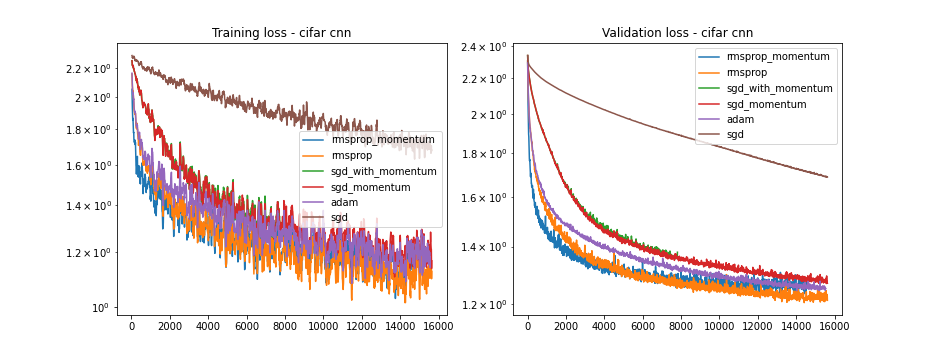
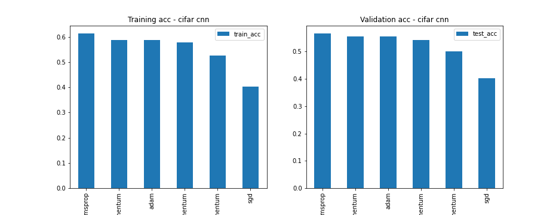
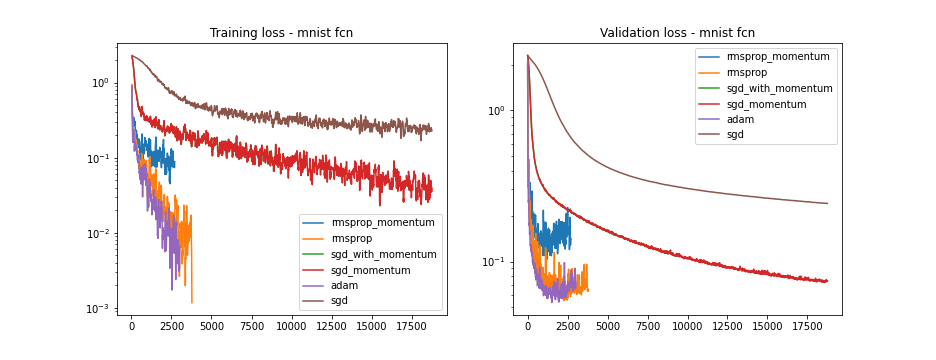
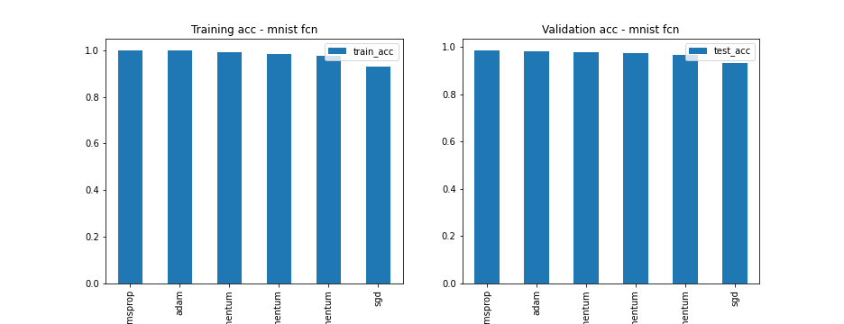

# Optimizer comparison for deep learning using Jax

Purpose - understanding differences in implementation and performance of optimizers. Whilst optimizers are implemented in `jax.experimental` already I reimplemented them in order to develop a deeper understanding.

Compared for MNIST and CIFAR-10 using a simple CNN and MLP. Some code borrowed from the JAX example pages.

- SGD
- SGD with Momentum
- RMSprop
- RMSprop with Momentum
- Adam

Notebook with results [here](./results.ipynb)

## Some Plots

